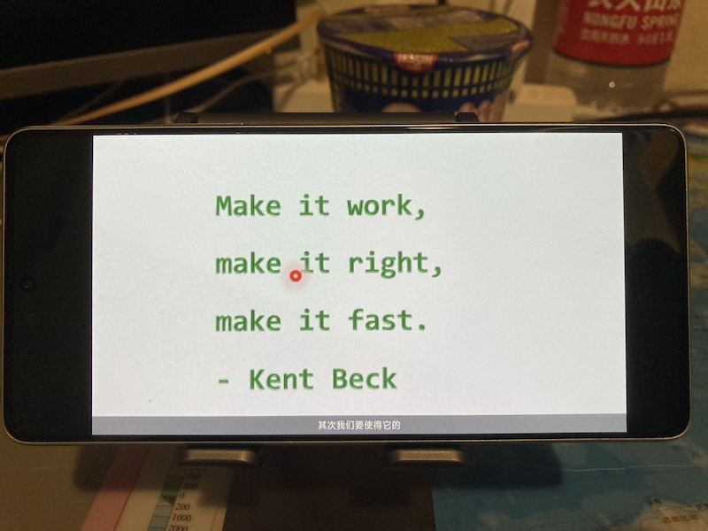

## 一些综合思考

- IT三层：基础理论、领域技术、应用产品。
- 前端图形重交互与构建，后端数据重储存与分析。
- 轻服务为本：做技术的最高境界就是不再做技术，因为技术就是最大最复杂的中间层，减少复杂繁多的中间层就是最重要的技术。直接追求服务创造与价值交换吧，产品也只是服务的工具。
- 小型化、轻量化、扁平化，去掉中间层，解构。
- 用综合的方法整合各种需求和技术来创新，而不只是单一需求与技术。
- 核心信息：如何获得事物清晰系统的信息图像，以便庖丁解牛般达成目标🎯？
- 新自然软件设计与开发，拟物风格，与卡片结合。
- 数据库、后端服务、前端界面等应该是整体，不能在应用层面单独隔离数据库角色。
- 一个完整的业务功能需要前后端和谐匹配，所以不应该分前后端两人来做，最好全栈。
- 人更在意的还是完成业务的过程而不只是业务对象，所以对流程的建模和编程也是非常必要的。
- 将数学语言与自然语言转化为计算机语言。
- 开发要适应流变的现实，细粒度，统合时空。
- 经济与 IT 都是抽象多于具体，前者是对价值的抽象并进行管理，后者是对信息的抽象并进行管理。
- 鸿鹄数图：从高层次总结数据的图示。

## 软件架构

1. [适用软件架构](/posts/20240623-fit-software)
2. 函数式架构
3. ECS架构
4. 面向对象架构

## 软件工程三指标：功能多少，安全与否，性能强弱

1. 功能是多少的问题，安全是对错的问题，性能是强弱的问题。
2. 在功能一定的情况下，安全就是最重要的指标，也是最复杂的指标，需要考虑系统漏洞、代码质量、可维护性、可测试性等，工程师考虑的很多问题都是安全问题。
3. 功能往往是产品设计考虑的，工程师只是实现。
4. 而性能很多时候是技术问题，一般利用第三方中间件来实现高性能。

## 一些高层编程（主要是函数式、并发）思考

- 越底层越面向控制流编程越简单越直接，越高层越面向数据流编程越并发越反应性。
- 感觉更高层的编程都会变成数据流编程，也包括状态的流转。只是实现方式不一样。底层的编程一般都是控制流编程，符合 CPU 指令的模式。
- 感觉并发编程就是在构建一个虚拟的流程图，要是能输出流程图就好了，可以更清晰。
- 变换流图编程，反应性活性编程，live programming。
- Live->Async->Coroutine->Concurrency->Complex->Nature。
- 很多函数式编程代码都是对流程的描述，把描述和执行分离了，赋值和副作用就是执行的一部分。

## 前端开发方法论

1. 精简：主要针对系统开发和基础设施的，比如框架、组件、核心模块等。
2. 轻敏：主要是针对应用开发和业务逻辑的，适应用户体验、需求变化、产品迭代等。具体措施如下：
    1. 尽量使用通用的资源，比如框架、组件库、样式库等。
    2. 尽量让约定大于配置，减少过度灵活性造成的混乱。
    3. 最小表达力原则，使用足够好而不过度的语言和工具解决问题。

## 🌃IT技术体系

理解 IT 体系非常重要，在体系->技术->应用链条中，体系是基础。

数据架构：
1. 持久层：数据库、文件系统等。
2. 服务层：服务端程序等。
3. 表现层：客户端程序等。

理论基础层：
1. 数据结构和算法
2. 编译原理
3. 计算理论

体系基础层：
1. 操作系统：Linux、Windows等。
2. 计算机网络：TCP/IP体系、WebSocket等。
3. 计算机语言：C、C++、Java、JavaScript、TypeScript、Lua等。

领域应用层：
1. 数据库：MySQL、MongoDB、Redis等。
2. 技术体系：Node.js体系、Java体系、HTML5体系等。
3. 计算机图形学
4. 计算机视觉
5. 人工智能

业务应用层：
1. 软件工程：代码质量管理、测试驱动开发等。
2. 开发工具：IDE、Git等。
3. 游戏开发：图形引擎、物理引擎、配置工具等。
4. 互联网应用开发：微信小程序、移动App等。

## 💎要素管理方法

1. 过于复杂的要素要抽象出来，统一管理。
2. 各要素集合要：高内聚低耦合。
3. 要素与对应的管理者：
    1. 模块化体系：管理功能。
    2. 组件化体系：管理UI。
    3. 状态库Redux等：管理应用状态。
    4. 响应式流库Rx等：管理数据流。
4. 要素管理者“系统”的关系和边界要明晰化。
    1. 系统正交。
    2. 系统风险隔离。

## 💿软件本质：多层面资源管理系统

对多个层面的资源（或实体、元素、功能等）进行建模、运行、管理的系统。

需要管理的资源：
1. 通用：风险、资金、人员、工作流等。
2. 业务：用户需求、功能设计、用户界面设计等。
3. 技术：部署、架构、设计、库、代码、数据、资源文件、硬件、计算资源等。

领域分析：
1. 算法：管理时间和空间的调配，解决计算问题。
2. 操作系统：管理各种形式的硬件资源，解决程序运行问题。
3. Web浏览器：管理各种Web界面的加载、运行和渲染等，解决Web内容的展示交互问题。
4. 游戏引擎：管理各种游戏内容的加载、运行和渲染等，解决游戏运行和玩家交互问题。

技术分形：每个技术层面都有类似的特征，如同分形。

关注点分离：
1. 硬件。
2. 运维。
3. 领域。
4. 用例。
5. 视图交互。
6. 样式。

思考🤔：
1. 透明。可观测可控制。
2. 迭代开发。
3. 声明式。
4. 信息驱动、数据驱动。
5. 抽象化、模块化、层次化。
6. 自适应、资源化、服务化。
7. 整洁的架构。不要模拟现实需求，而要转化现实需求，建立整洁而高效的架构。因为现实需求过于复杂多变。
8. 信息流：界面、逻辑、存储，差不多是前端、后端、数据库。

计算机程序从简单到复杂大体分三类：程序脚本（可用、策划脚本、Python、程序员）->业务功能（+稳健、游戏产品、Java、工程师）->技术系统（+高性能、游戏引擎、C/C++、专家）
